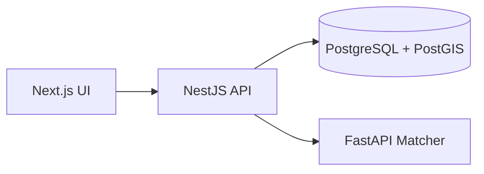

# Volunteer Matcher

Web application for matching **shelter tasks** with **volunteer offers** under distance, skill, and time constraints. A **NestJS** API stores data in **PostgreSQL + PostGIS**, orchestrates pre-filtering and approval, and calls a **Python/FastAPI matcher** with several assignment algorithms. The UI is **Next.js**.

Bachelor thesis prototype — production-oriented enough for Docker, CI, and cloud deploy (Render + Vercel).

## Architecture



**Match pipeline (coordinator):** load open tasks/offers → apply time cutoff → PostGIS distance prefilter → `POST /match` to matcher → review → `POST /assignments/approve`.

| Component | Role |
|-----------|------|
| **Frontend** | Role-based UI: tasks, offers, matching, assignments |
| **Backend** | Auth (JWT), CRUD, match orchestration, assignments |
| **Matcher** | Pure assignment algorithms on a JSON payload |
| **PostgreSQL** | Persistent storage, geography for spatial queries |

## Stack

| Layer | Technologies |
|-------|----------------|
| API | NestJS, TypeORM, JWT, Swagger |
| Database | PostgreSQL 16, PostGIS |
| Matcher | FastAPI, SciPy / graph algorithms |
| UI | Next.js (App Router), TypeScript |
| Local infra | Docker Compose |

## Features

- **Roles:** `coordinator`, `shelter`, `volunteer` — JWT on protected routes.
- **Demo seed:** with `SEED=true` and an empty DB, loads `backend/src/seed/dev-seed.json` (password **`demo123`** for seeded users).
- **Matching cutoff:** tasks starting within **24 h** are skipped in batch match unless marked **Urgent** (`MATCHING_CUTOFF_HOURS_BEFORE_START`, `0` disables).
- **Algorithms:** `greedy`, `hungarian`, `max_coverage`, `bottleneck` — same hard constraints, different objectives.
- **Health:** `GET /health` checks DB + matcher (for Render cold start).

**Swagger:** `{backend}/api` · **Matcher OpenAPI:** `{matcher}/docs`

## Quick start (Docker)

From the repository root:

```bash
cp .env.example .env
# Optional local demo users: add SEED=true to .env (compose defaults SEED=false)
docker compose up --build -d
```

Apply migrations after first start or schema upgrades:

```bash
cd backend && npm run migration:run
```

| Service | URL |
|---------|-----|
| Frontend | http://localhost:3001 |
| Backend / Swagger | http://localhost:3000 · http://localhost:3000/api |
| Matcher | http://localhost:8000 · http://localhost:8000/docs |

Smoke checks:

```bash
./scripts/smoke-api.sh
./scripts/smoke-match-algorithms.sh
```

Development without Docker: **[LOCAL_DEV.md](LOCAL_DEV.md)**.

## Repository layout

```
backend/              NestJS API, entities, migrations, e2e tests
frontend/             Next.js UI (deploy root for Vercel)
matcher_service/      FastAPI matcher, benchmarks, test cases
scripts/              smoke tests, CI helpers, benchmark pipeline
postgres/init/        PostGIS extension for Docker Postgres
docker-compose.yml    Local full stack
.env.example          Compose env template (secrets stay local)
```

## Matching rules (all algorithms)

- **Distance:** Haversine km ≤ volunteer `max_distance_km`.
- **Skills:** task `required_skills` ⊆ offer `skills`.
- **Time:** strict overlap — `max(start) < min(end)` (touching endpoints do not match).
- **One-to-one:** at most one task per offer per batch.

## Algorithms

| Key | Objective |
|-----|-----------|
| `greedy` | Earliest tasks first; nearest feasible volunteer (baseline) |
| `hungarian` | Minimize sum of distances |
| `max_coverage` | Maximize match count; tie-break on distance |
| `bottleneck` | Maximize coverage, then minimize max pairwise distance |

Match score when returned: `1 / (1 + distance_km)`.

## Tests & CI

```bash
# Matcher (needs matcher on :8000)
cd matcher_service && python3 test_matcher.py

# Backend e2e (Docker network — avoids host Postgres on :5432)
./scripts/run-e2e.sh

# Full local CI (matcher tests + e2e + smoke)
./scripts/run-ci-local.sh
```

GitHub Actions (`.github/workflows/ci.yml`): PostGIS service, matcher tests, backend e2e, HTTP smoke scripts.

**Benchmarks** (optional, for experiments): `./scripts/run_benchmarks.sh` — writes dated artifacts under `matcher_service/results/` (gitignored).

## Deployment

Typical split:

| Service | Platform | Notes |
|---------|----------|-------|
| Frontend | **Vercel** | Root directory `frontend`; env `NEXT_PUBLIC_API_URL` = public backend URL (no trailing slash) |
| Backend | **Render** | `npm run render:build`; env below |
| Matcher | **Render** (Docker) | Internal URL from backend |
| Database | **Render Postgres** | Run `CREATE EXTENSION postgis;` |

**Backend environment (production):**

| Variable | Value |
|----------|--------|
| `DATABASE_URL` | From provider |
| `MATCHER_URL` | Internal matcher URL |
| `JWT_SECRET` | ≥ 8 characters |
| `SEED` | `false` |
| `TYPEORM_SYNCHRONIZE` | `false` |
| `HEALTH_CHECK_MATCHER` | `true` |

After deploy: `cd backend && npm run migration:run` against production `DATABASE_URL`.

Do **not** commit `.env` or `backend/.env` — use provider dashboards and `.env.example` as reference.

## Security notes

- Matcher service has no auth — keep it on a private/internal URL in production.
- JWT stored in browser `localStorage` (prototype limitation).

## License

Add a `LICENSE` file if you redistribute the repository.
